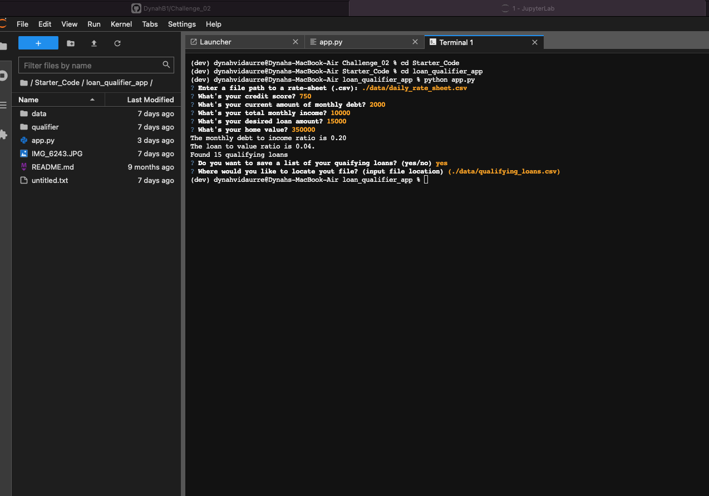

# **Challenge_02**

---

## *Welcome to my loan qualifier app. This is a helpfull program that will automatize the application process to obtain a loan from different banks. Feel free to explore my codebase!* 

```python
text = "The saved list of loans you qualify for can be found in this file qualifying_loans.csv.""
```

---

> Modules

## Programs 

[Programs](Starter_Code/loan_qualifier_app/qualifier/filters)

## Utils

[Utils](Starter_code/loan_qualifier_app/qualifier/utils/)

## Data Files

[Data files](Starter_Code/loan_qualifier_app/data/daily_rate_sheet.csv)

## Picture of the app working 




---

### *I am learning how to make my readme,md more user friendly*
